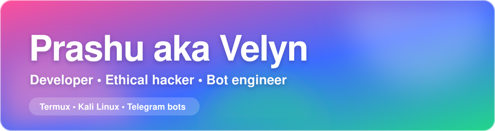

  

  
  

## Hi, I'm Prashu 👋

Student developer. I build software end to end, mostly from my Android phone using Termux and Kali Linux.

## What I build

- 🤖 **Telegram bots**: command and inline interfaces, admin tools, resilient deployment
- 🌐 **Web interfaces**: mobile-first, fluid and visually distinctive
- ⚙️ **Automation**: scheduled and event-driven workflows
- 🛡️ **Security assessments**: scoped and authorised testing only

## Tech

  
  
  
  
  
  
