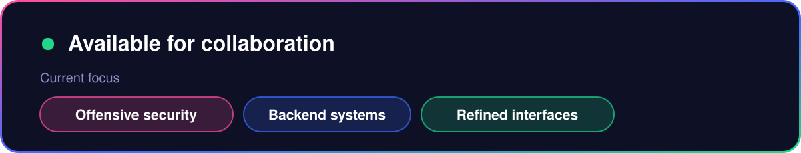
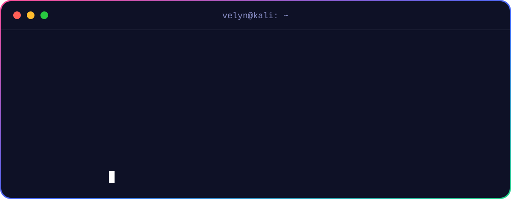
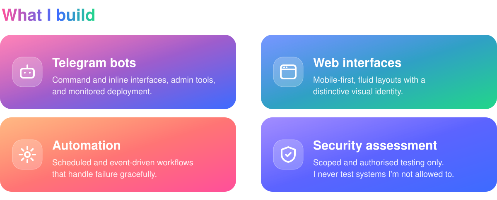
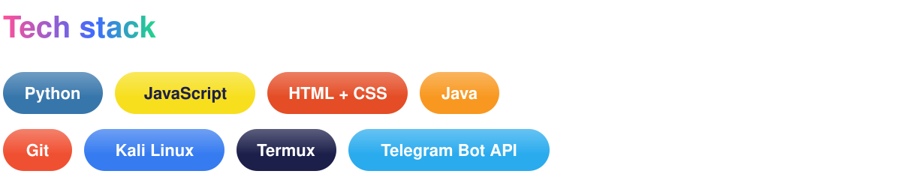
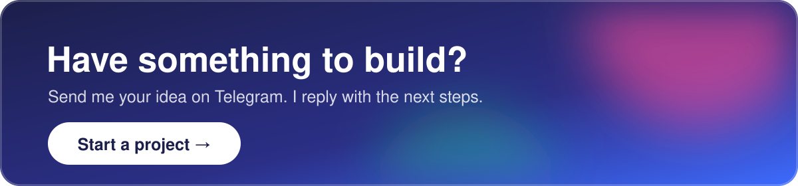

  

  
  

  

  

  

  

  

  Student developer building software end to end, mostly from an Android phone. 
  Most of my current projects are private. Want a walkthrough? <a href="https://t.me/Velynx007">Message me on Telegram</a>.

  

